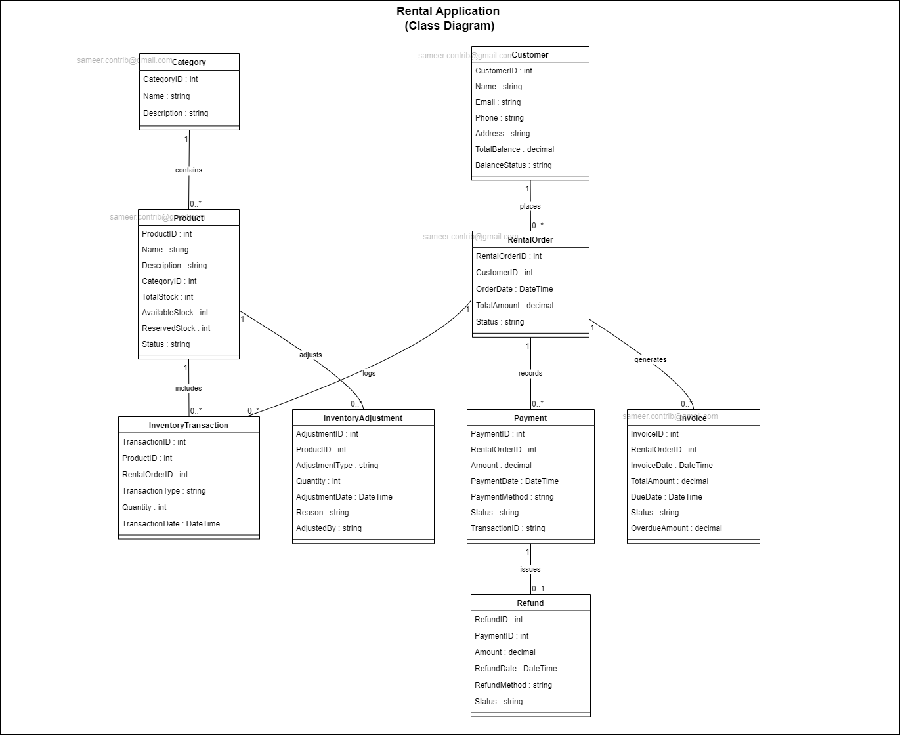

# Bike Renting Service

## Problem Statement
* You've been hired by a bike shop to create software 
to help them with their rental operation.
* This includes automating activities such as keeping track of 
inventory, customers, stock items that are rented, customer fee accrual etc...
* The store rents two types of products: Bikes and Scooters.
* Each bike is made in one of three different sizes, Small, Medium, Large 
and will fit small, medium and large humans respectively. 
* We'd like to be sure our customers get a bike that fits them and will need to track size of our bikes.
* The scooters are available in electric motor or gas motor styles.
* The styles of scooters are very different, 
so we want to track them separately, 
so we can match our customers needs to the appropriate scooter.

## Required Queries
* How many small bikes do you have?
* What vehicle are there for rent?
* Does this customer have a balance? (aka owe us money)
* What vehicle are rented?
* Are there vehicles that are overdue for return? Who has them?
* What vehicles has a customer rented?

## Required commands
* Add a vehicle to inventory
* Add a customer
* Remove a vehicle from inventory (permanently not for rental, i.e. it's been damaged)
* Record that a vehicle is rented to a customer
* Create a charge for the customer

## Deliverables
Can include but not limited to:
* API spec
* Class diagrams
* Schema design

### Class Diagram

# Status Value Table

| **Entity**             | **Status**        | **Value**            | **Explanation** |
|------------------------|------------------|----------------------|-----------------|
| **Product**            | Active           | `Active`             | Product is available for rent. |
|                        | Inactive         | `Inactive`           | Product is not available for rent (e.g., discontinued). |
|                        | Damaged          | `Damaged`            | Product is damaged and cannot be rented out. |
|                        | Out of Stock     | `OutOfStock`         | Product is out of stock and cannot be rented out. |
| **Rental Order**       | Active           | `Active`             | Rental order is currently in process (e.g., items have been rented out). |
|                        | Completed        | `Completed`          | Rental order is fulfilled and completed. |
|                        | Cancelled        | `Cancelled`          | Rental order has been cancelled by the customer or system. |
|                        | Overdue          | `Overdue`            | Rental order is overdue for return or payment. |
| **Rental Order Item**  | Rented           | `Rented`             | Item is currently rented out. |
|                        | Returned         | `Returned`           | Item has been returned by the customer. |
|                        | Damaged          | `Damaged`            | Item was returned in a damaged condition. |
|                        | Lost             | `Lost`               | Item has been reported lost. |
| **Payment**            | Pending          | `Pending`            | Payment is initiated but not yet completed. |
|                        | Completed        | `Completed`          | Payment has been successfully completed. |
|                        | Failed           | `Failed`             | Payment attempt failed. |
|                        | Refunded         | `Refunded`           | Payment has been refunded to the customer. |
| **Invoice**            | Paid             | `Paid`               | Invoice has been fully paid by the customer. |
|                        | Unpaid           | `Unpaid`             | Invoice is not yet paid. |
|                        | Overdue          | `Overdue`            | Invoice payment is overdue. |
| **Refund**             | Pending          | `Pending`            | Refund is initiated but not yet processed. |
|                        | Completed        | `Completed`          | Refund has been successfully processed. |
|                        | Failed           | `Failed`             | Refund attempt failed. |
| **Customer**           | Good Standing    | `GoodStanding`       | Customer has no outstanding balance. |
|                        | Overdue          | `Overdue`            | Customer has overdue payments. |
|                        | Blocked          | `Blocked`            | Customer is blocked from making new rentals due to overdue balances. |
| **Inventory Adjustment** | Stock In       | `StockIn`            | Inventory has been increased (e.g., restocking). |
|                          | Stock Out      | `StockOut`           | Inventory has been reduced (e.g., product removed permanently). |
|                          | Damage         | `Damage`             | Inventory adjustment due to damage. |
|                          | Correction     | `Correction`         | Adjustment made to correct inventory discrepancies. |

